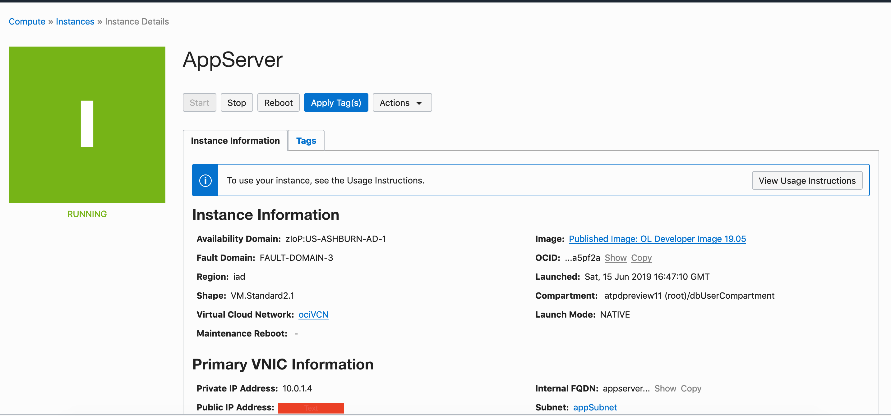
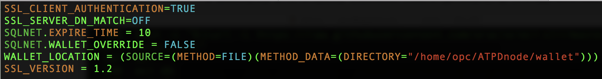
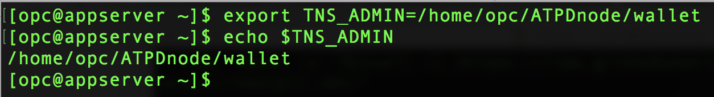
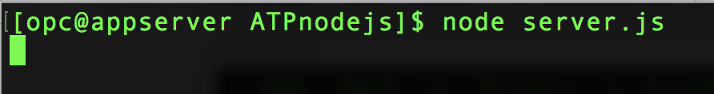
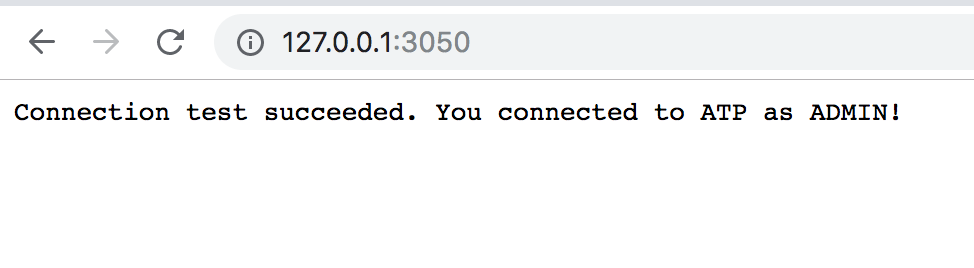

# Building and deploying node.js application stacks on dedicated autonomous infrastructure

## Introduction
The Oracle Cloud Infrastructure marketplace provides a pre-built image with necessary client tools and drivers to build applications on autonomous databases. As an application developer you can now provision a developer image within minutes and connect it to your dedicated or serverless database deployment. 

The image is pre-configured with tools and language drivers to help you build applications written in node.js, python, java and golang.
For a complete list of features, login to your OCI account, select 'Marketplace' from the top left menu and browse details on the 'Oracle Developer Cloud Image'.

*In this lab we will configure and deploy a node.js application in a developer client VM and connect it to an autonomous database.*

### Objectives

As an application developer,
1. Learn how to deploy a node.js application and connect it to your dedicated autonomous database instance.


### Required Artifacts

- An Oracle Cloud Infrastructure account.

- A pre-provisioned instance of Oracle Developer Client image in an application subnet. Refer to [Lab 6](?lab=lab-6-configuring-vpn-into-private-atp).

- A pre-provisioned dedicated autonomous database instance. Refer to [Lab 4](?lab=lab-4-provisioning-databases).

- A network that provides connectivity between the application and database subnets. Refer to [Lab 1](?lab=lab-1-prepare-private-network).

## STEP 1: Instance Setup

- Login to your Oracle Cloud Infrastructure account select *Compute* —>  *Instances* from top left menu.
    

- Select the right Oracle Developer Cloud image you created in earlier labs. 

- Copy the public IP address of the instance in a note pad. 
    


**Mac / Linux users**

  - Open Terminal and SSH into linux host machine, we will need port forwarding to see the Node application running in our local browser. If you use VNC then there is no need to configure port forwarding.

    ```
    <copy>
    sudo ssh -i /path_to/sshkeys/id_rsa -L 3050:127.0.0.1:3050 opc@publicIP
    </copy>
    ```

    

**Windows users**

  - You can connect to and manage linux host mahine using SSH client. Recent versions of Windows 10 provide OpenSSH client commands to create and manage SSH keys and make SSH connections from a command prompt.

  - Other common Windows SSH clients you can install locally is PuTTY. Click [here](https://docs.microsoft.com/en-us/azure/virtual-machines/linux/ssh-from-windows) to follow the steps to connect to linux host machine from you windows using PuTTY.

## STEP 2: Download sample Node.js Application

- Once you ssh into your developer client machine you can download a sample node.js application to folder /home/opc using the following command,

    ```
    <copy>
    wget https://objectstorage.us-ashburn-1.oraclecloud.com/p/b47YwTBhIc8MGxgoS7iNamnbK4oL3a6N7dP1aKHw7uU/n/atpdpreview11/b/adb-build-and-deploy-nodejs/o/ATPDnode.zip
    </copy>
    ```

    ```
    <copy>
    mkdir /home/opc/ATPDnode && cd /home/opc/ATPDnode && unzip /home/opc/ATPDnode.zip
    </copy>
    ```

Now that you have a sample application setup, lets get your database's secure wallet for connectivity.

## STEP 3: Transfer database wallet to developer client

- Login to Oracle Cloud Infrastructure account and select *Autonomous Transaction Processing* from the menu.
    

- Click on Autonomous Database and select your previously created database.
    

- Click on DB Connection and under Download Client Credential(Wallet) click *Download*.
    

- Provide a password for your wallet and  download wallet.
    

- The credentials zip file contains the encryption wallet, Java keystore and other relevant files to make a secure TLS 1.2 connection to your database from client applications. Store this file in a secure location.

- Let us now secure copy the downloaded wallet to our linux host machine.

- Open Terminal in your laptop and type in the following commands.

    *Note: Please change path and name of your private ssh keyhole,   wallet and the ip address of your developer client in the command below.*

    ```
    <copy>
    scp -i /Path/to/your/private_ssh_key /Path/to/your/downloaded_wallet opc@publicIP:/home/opc/
    </copy>
    ```
    

## STEP 4: Run your node.js application

Now that you have copied the database wallet to your development host, lets configure some env. variables and database authentication file to connect your node.js app to the database.


- On your dev host, create a new directory for wallet and unzip the wallet.

    ```
    <copy>
    cd /home/opc/ATPDnode/

    mkdir wallet

    unzip Wallet_ATPDedicatedDB.zip -d /home/opc/ATPDnode/wallet/
    </copy>
    ```

- The sqlnet.ora file in your wallet folder needs to have an entry pointing to the location of the wallet folder. Open the file in vi editor as follows,

    ```
    <copy>
    vi /home/opc/ATPDnode/wallet/sqlnet.ora
    </copy>
    ```

- Change *DIRECTORY* path to /home/opc/ATPDnode/wallet/ and save the file.
    

- Next, we also set up an environment variable TNS_ADMIN to point to the wallet location.

    ```
    <copy>
    export TNS_ADMIN=/home/opc/ATPDnode/wallet/
    </copy>
    ```

- Verify TNS_ADMIN path

    ```
    <copy>
    echo $TNS_ADMIN
    </copy>
    ```
    

And finally, lets edit the dbconfig.js file in /home/opc/ATPDnode/ATPDnode-master folder with the right admin credentials and connect string. 

- Password for user 'admin' was set at the time of database creation.
  
- Connectsring for your database is available on the cloud console. Check previous connectivity labs.

    ```
    <copy>
    module.exports= {
    dbuser:"admin",
    dbpassword:"yourAdminPassword",
    connectString :"databaseName_tp_tls"
    }
    </copy>
    ```
- Run the node application.

    ```
    <copy>
    node server.js
    </copy> 
    ```
    

- From within your VNC session, open a browser and go to localhost:3050 to see the successful connection!
    

## Acknowledgements

*Congratulations! You successfully deployed and connected a node.js app to your autonomous database.*

- **Author** - Tejus S. & Kris Bhanushali
- **Adapted by** -  Yaisah Granillo, Cloud Solution Engineer
- **Last Updated By/Date** - Kris Bhanushali, June 2020

See an issue?  Please open up a request [here](https://github.com/oracle/learning-library/issues).   Please include the workshop name and lab in your request. 