# Building Apex application on dedicated autonomous database

## Introduction
Oracle Application Express (Oracle APEX) is a rapid web application development tool for the Oracle database. Using only a web browser and limited programming experience, you can develop and deploy professional applications that are both fast and secure. Oracle APEX is a fully supported, no cost option of the Oracle database.

Why would you use Oracle APEX?

Oracle Application Express (APEX) is a low-code development platform that enables you to build scalable, secure enterprise apps, with world-class features, that can be deployed anywhere.

**Low Code Development**
- With Oracle APEX and low code, your organization can be more agile develop solutions faster, for less cost, and with greater consistency. You can adapt to changing requirements with ease. Empower professional developers and everyone else in your organization to be a part of the solution.
  
    [Learn More on Low Code Development](https://apex.oracle.com/en/platform/low-code/)

### Objectives

1. Access OCI autonomous database console and get URL for apex web cosole.
2. Create a VNC connection to developer client VM and access apex on your database as admin user.
3. Setup additional apex developer users.

### Required Artifacts

- An Oracle Cloud Infrastructure account with access to Autonomous Transaction Processing console.
- A pre-provisioned autonomous database with admin access.
- A pre-provisioned developer client machine with network access to database.

## STEP 1: Accessing the OCI Autonomous Transaction Processing console and finding APEX URL

- To get the APEX URL for your ATP Dedicated instance, log into the Oracle Cloud and navigate to Autonomous Transaction Processing option from the Hamburger menu. 
- On the Autonomous Database console, select the ATP-Dedicated database you created.
- On your database console, click on DB Connection -> Click on Application Connection -> copy the URL for APEX.
- Save the URL as we are going to need it later in this lab.

    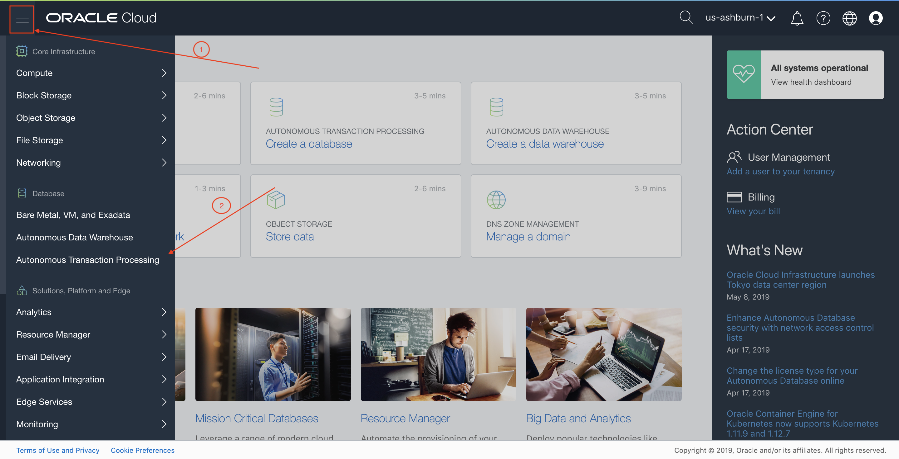
    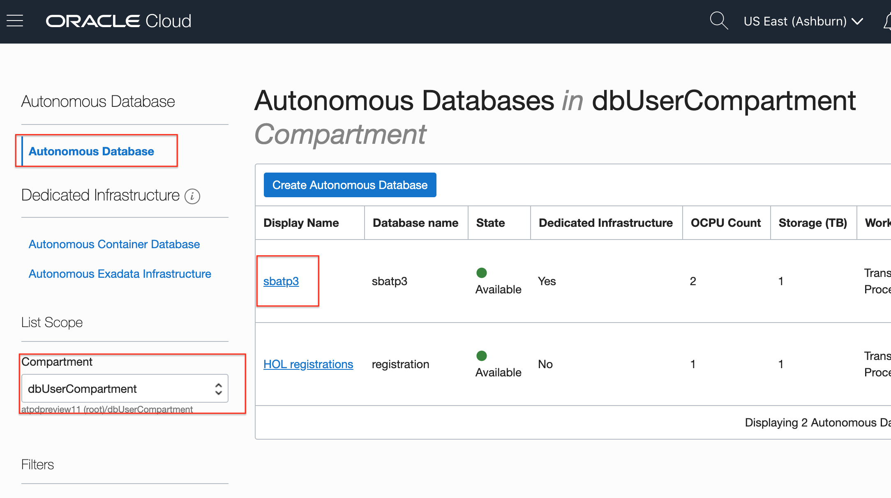
    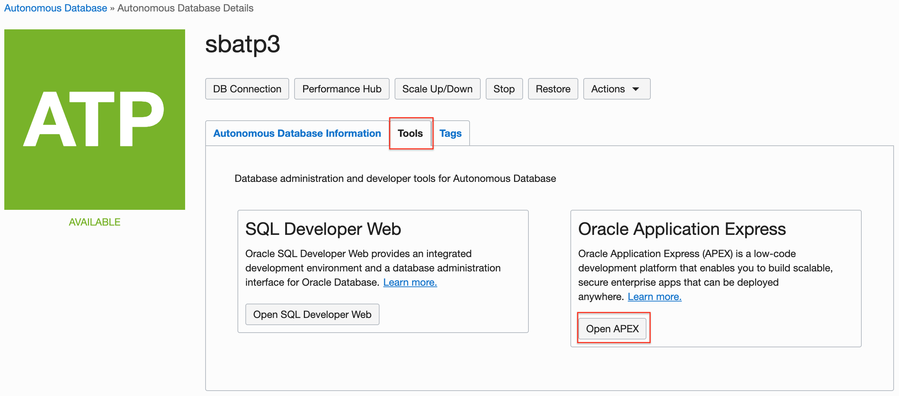
    


## STEP 2: Setup VNC connection to the developer client VM and access APEX on the database as an admin user

- Since ATP Dedicated instances are typically deployed in a private network, one way to get to your APEX console is via a developer client machine setup in the same network.

- Refer to [Lab 6](?lab=lab-6-configuring-vpn-into-private-atp) for instructions on setting up and connecting to a developer client machine.

- For the purpose of this lab we assume that your have already deployed and have ssh access to a developer client virtual machine in a public application subnet.

- Alternatively, you may also access the Apex console of your dedicated ATP instance from your local web browser If you are in the same OCI Network / VCN as your database. For detailed instruction on setting up a VPN connection into your private database cloud infrastructure, refer to [Lab 5](?lab=lab-5-configuring-development-system).


- Open a terminal window on your machine and log into the developer VM.

    ```
    <copy>
    $ssh -i <private ssh key> opc@<public ip of developer image vm>
    </copy>
    ```

- A VNC Server is pre-installed in the developer client image. Simply start your vnc server and provide a password when prompted.

    ```
    <copy>
    $vncserver
    </copy>
    ```

    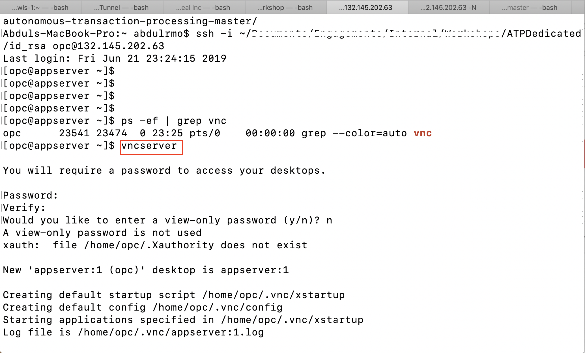

- On another terminal window and execute the below command to create a tunnel from your local machine to the developer VM.

    ```
    <copy>
    ssh -i <private ssh key> -L 5901:127.0.0.1:5901 opc@<public ip developer image vm> -N
    </copy>
    ```

    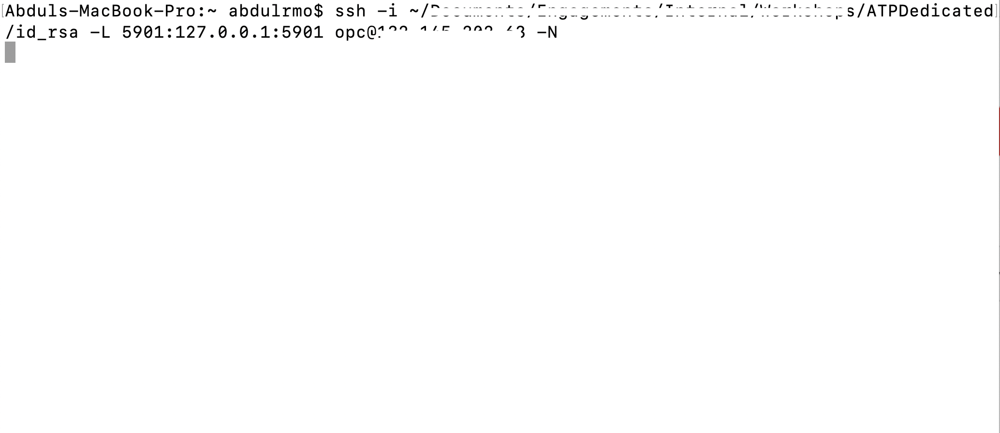

    *Note:  If you are a windows user, you can use Putty  to create a tunnel into the Developer VM.*

- Open the VNC Viewer application running on your local computer and connect to the VNC server as show below.

    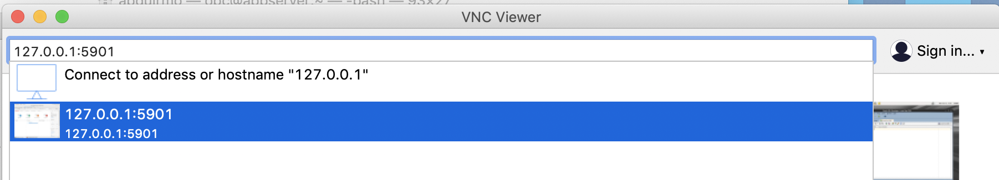
    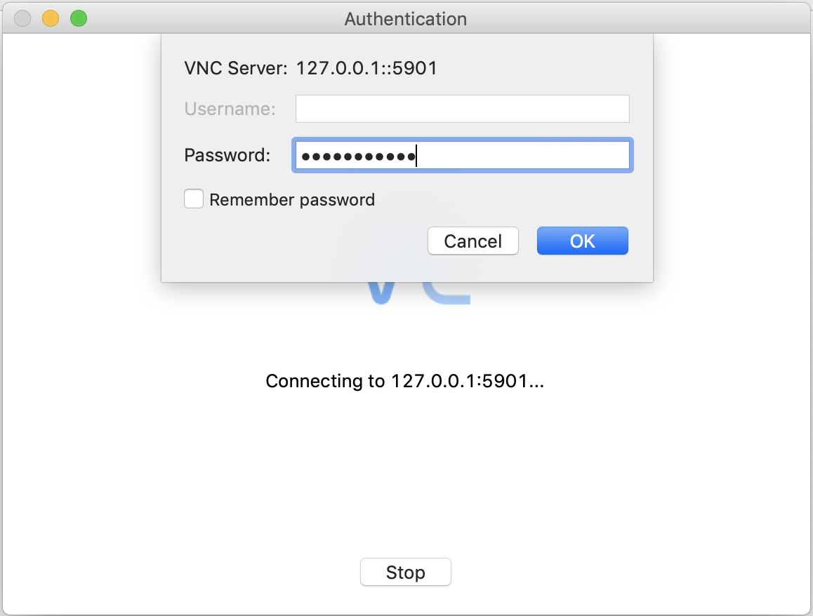
    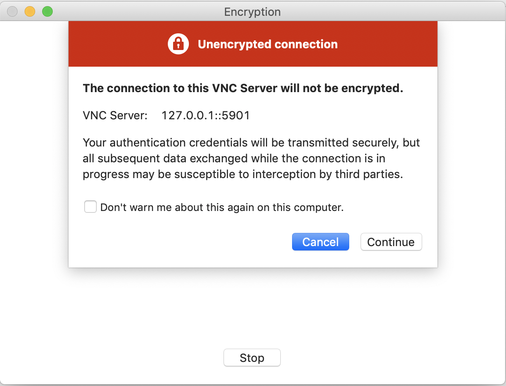
    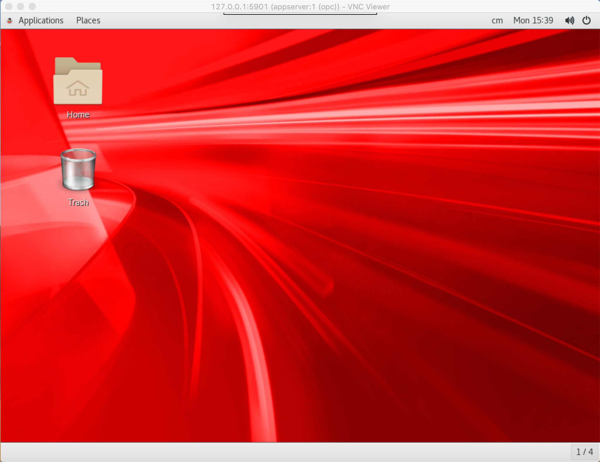

## STEP 3: Setting up additional users on APEX
- When you have logged into the VNC, use the URL you saved in step 1 and paste it in the browser in the VNC to connect to APEX on your ATP-D database. You will the APEX login page for your database.

- Login to APEX, by using the following credentials.

    ```
    <copy>
    Workspace : Internal
    username : Admin
    password : <You database admin password>
    </copy>
    ```

    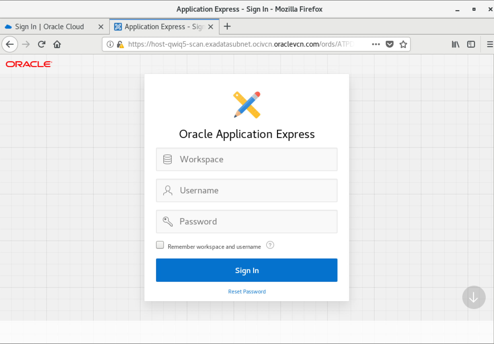
    

    *Note: If you are an experienced APEX user, you can just click on Create a Workspace and skip the next 3 steps.*

- Click on Manage Workspace, this page will have all the options for you to manage your workspace or all the workspaces if you are an admin.

- Click on Monitor activity, this page allows you to manage and monitor your applications.
    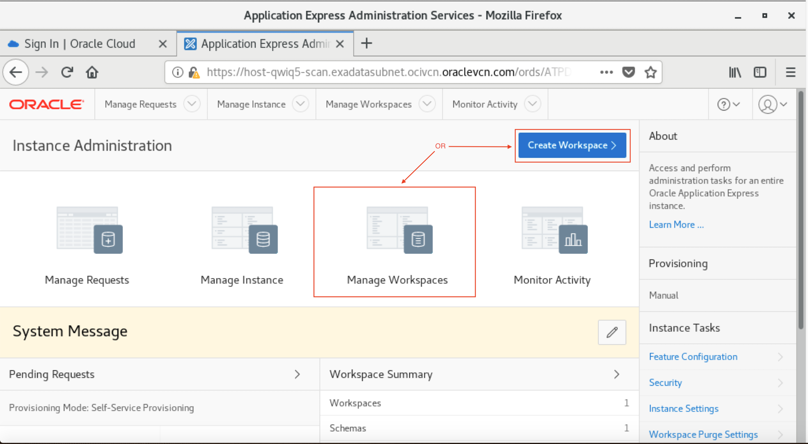

- Now, go back to the Manage workspace page and click on create workspace option.
    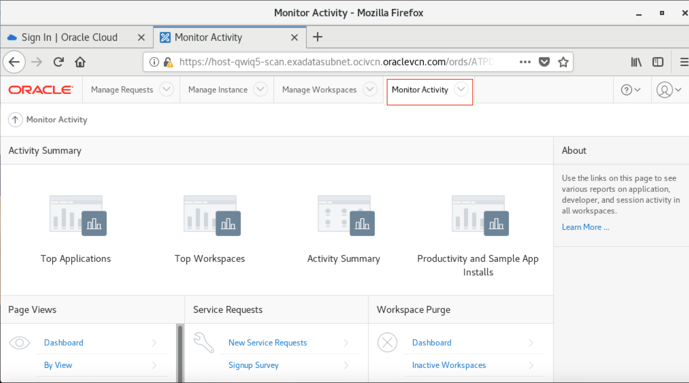

- Enter a workspace name for your new workspace.Click next.
    

- In the dialog box, Select yes, if you want to re-use schema from your database. Select No, if you want to create a new schema for your workspace. in this lab we are going to create a new schema.
    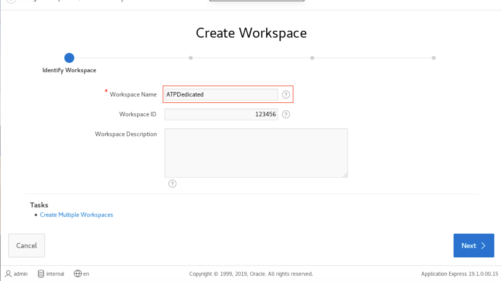

- Enter a Schema Name and a password for that schema. Click next.
    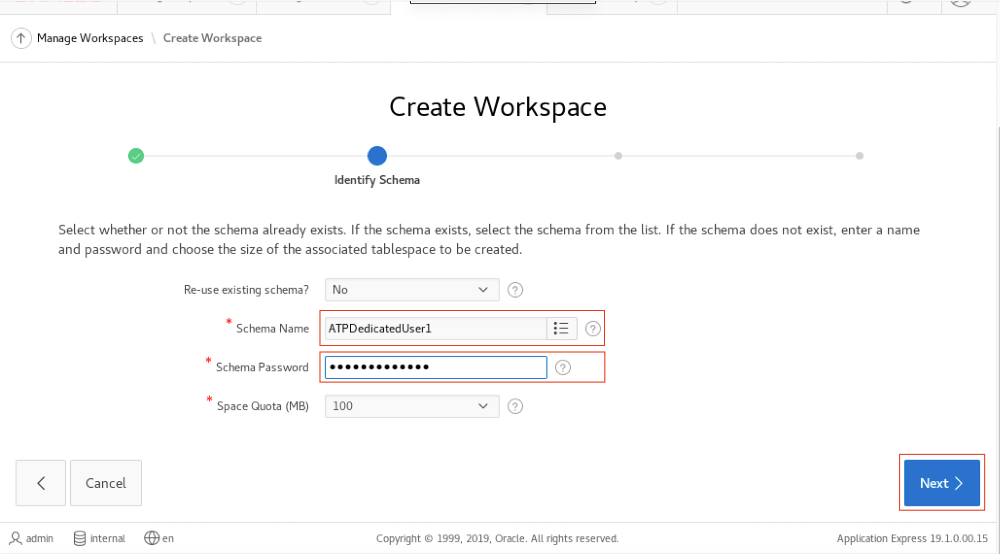

- Enter a password for the workspace admin, enter name(optional) and give an email id for the confirmation email.
    

- Verify the information you just entered and click Create Workspace.
    

- You will see a conformation message stating that the workspace has been created.
    

- On the top right corner of the page, click on the profile menu and sign out. Sign in to the new workspace using the workspace credentials you just created.

    ```
    <copy>
    Workspace : new workspace name
    username : Admin
    password : <You new workspace admin password>
    </copy>
    ```

    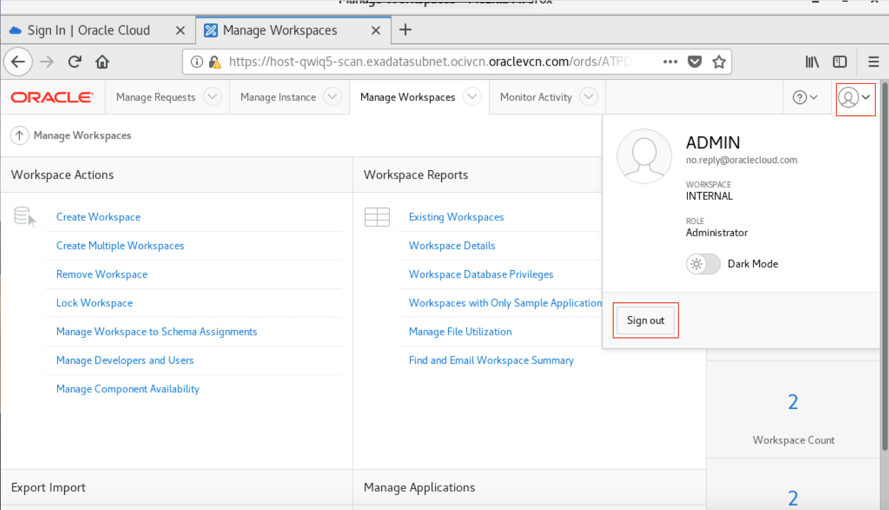
    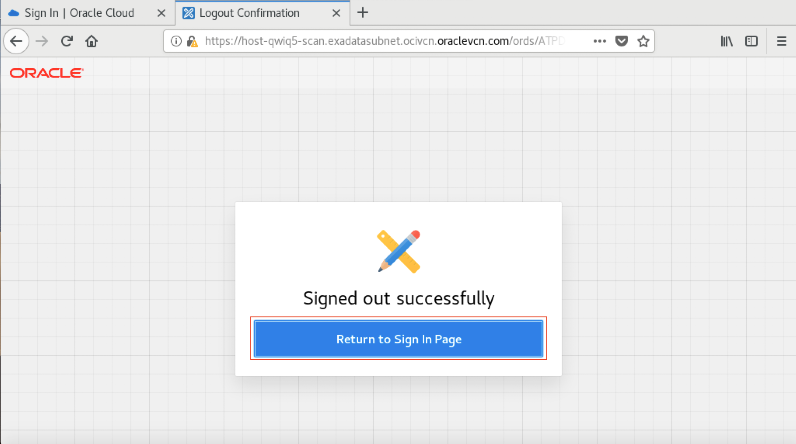
    

- Change the workspace password, if prompted.
    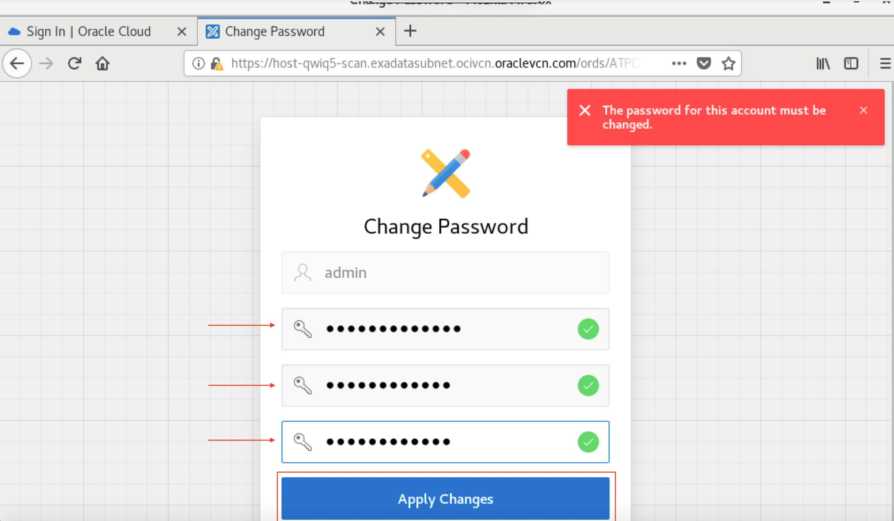

- You have now logged into the new workpace that you have created and can start developing your application right away!
    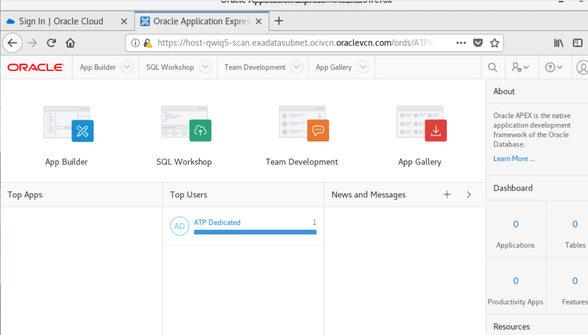


## Acknowledgements

*Great Work! You successfully learned to access the Apex console, create worksheets and add additional database users to Apex.*

- **Author** - Tejus S. & Kris Bhanushali
- **Adapted by** -  Yaisah Granillo, Cloud Solution Engineer
- **Last Updated By/Date** - Yaisah Granillo, March 2020

See an issue?  Please open up a request [here](https://github.com/oracle/learning-library/issues).   Please include the workshop name and lab in your request. 