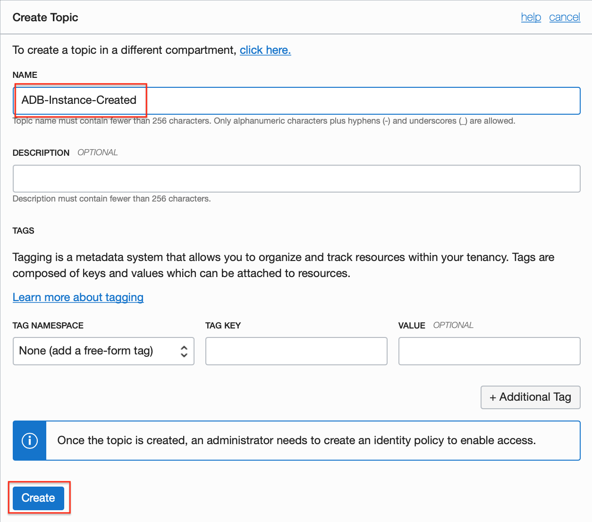
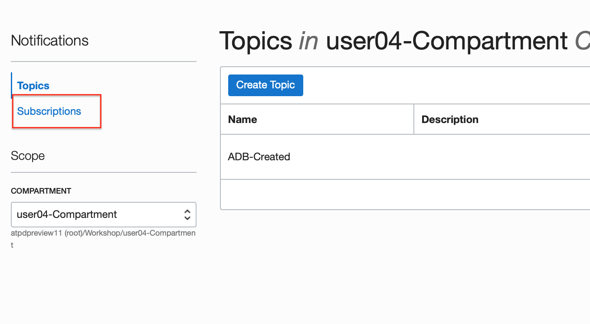
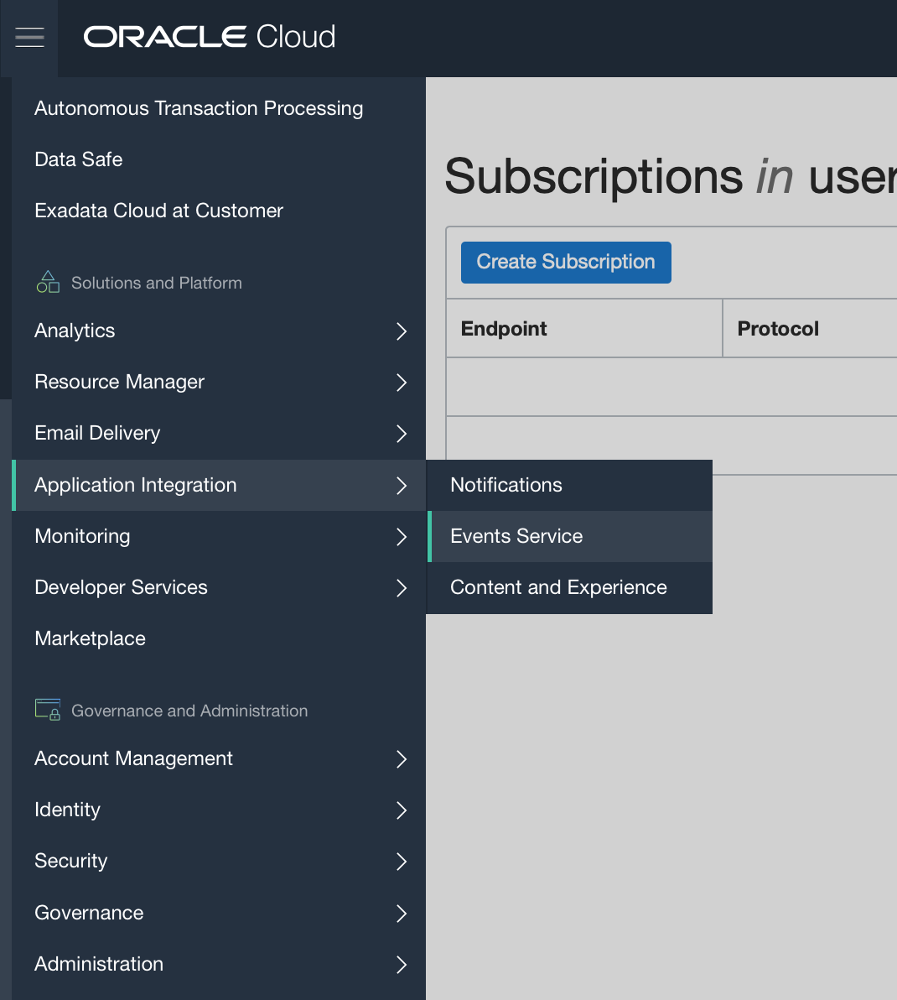
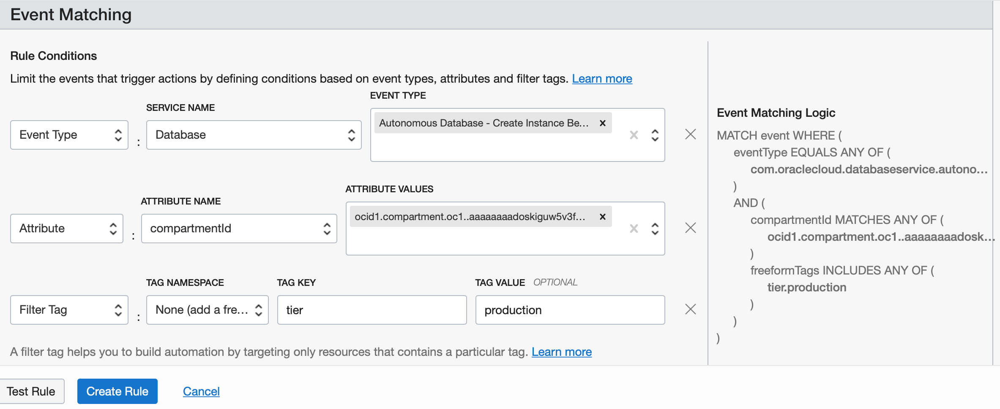
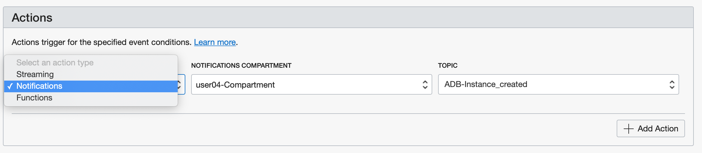

# Setup ADB event notifications through OCI Notification Service

## Introduction
The Oracle Cloud Infrastructure Notifications service broadcasts messages  to distributed components through a publish-subscribe pattern, delivering secure, highly reliable, low latency and durable messages for applications hosted on Oracle Cloud Infrastructure and externally. 

You may get notified when service events occur, such as database creation, termination etc. or when alarms trigger eg. cpu usage exceeds threshold. Subscribers may choose to be notified via email, SMS messages to their phones or via Slack channels.

### Objectives
As an database developer or adminstrator,
1. Learn how to set up autonomous database event topics.
2. Subscribe to database events via email and SMS.

### Required Artifacts
- An Oracle Cloud Infrastructure account with priviledges to provision an autonomous database and create ONS topics and events.

## STEP 1: Setup email / SMS notification on ADB provisioning events

- Lets start by setting up a simple email / SMS notification when autonomous database instances are provisioned in the users compartment.

- Login to your OCI tenancy and navigate to 'Application Integration' --> 'Notifications' from top left hamburger menu.
    

- Select the desired compartment from the drop down and hit 'Create Topic'.
    

- Provide a topic name, an optional description and hit 'Create'.
    

- Next, lets add some subscribers to this topic. On the Notification page, select 'Subscriptions' on top left.
    

- On the 'Create Subscription' page, select the topic you just create, pick 'Email' from the protocol dropdown and provide your email address as shown.
    

- To setup an SMS notification simply add your email-to-SMS address. Most carriers support sending SMS over email. For eg. AT&T users can send SMS messages using the email id <10-digit-phone#>@mms.att.net

- A complete list of email-to-SMS formats supported by various carriers is provided [here](https://avtech.com/articles/138/list-of-email-to-sms-addresses/).
    

- Now that we have a topic and subscribers in place, lets create an event that feeds to this topic. Navigate to OCI Events from the main menu.
    

- On the Create Rule page provide a name and event conditions as shown in the screen shot below. A rule condition can be an event-type with one or more attributes and fiter tags. 

    - For example, here our event-type is 'Autonomous Database - Create Instance Begin' and is set on the 'Database' service for compartment user04Compartment (we provide the OCID in the attribute) with a filter tag to indicate 'production' instances only.

    - Basically, what we are saying here is 'Trigger a notification event when an Autonomous Database with a tag tier=production is created in the compartment with OCID xyz...
      
      

- Scroll down to select the Action type for this event and pick Notifications and the topic you just created.
    

- Thats it! To test your notification setup, create an autonomous database service instance as explained in Lab 4.

## Acknowledgements
*Congratulations! You successfully learnt to create DB event subscriptions and setup notifications!*

- **Author** - Tejus S. & Kris Bhanushali
- **Adapted by** -  Yaisah Granillo, Cloud Solution Engineer
- **Last Updated By/Date** - Yaisah Granillo, April 2020

See an issue?  Please open up a request [here](https://github.com/oracle/learning-library/issues).   Please include the workshop name and lab in your request. 