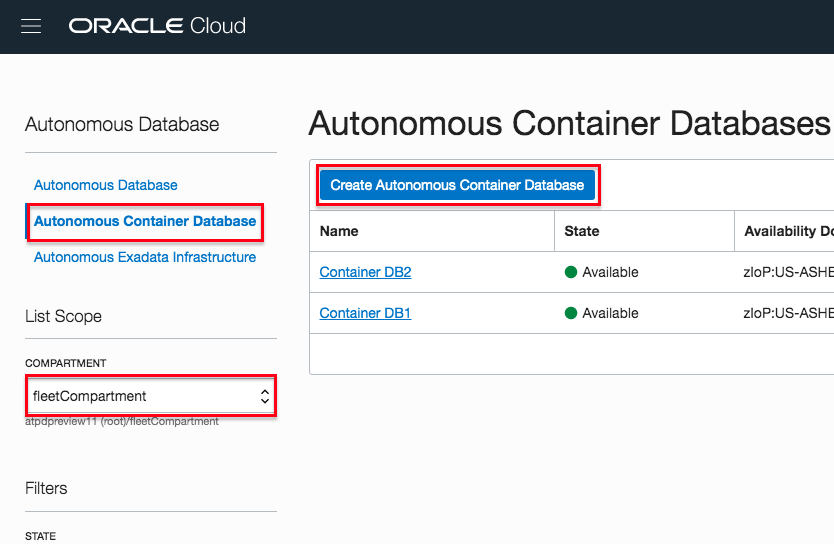
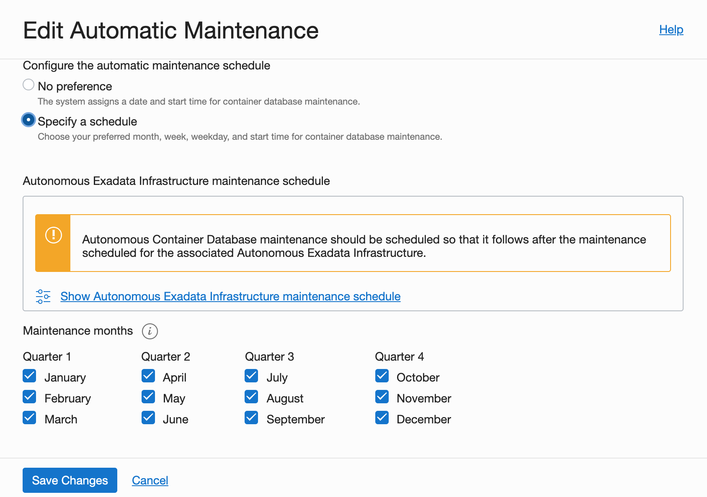

# Provisioning an Autonomous Container Database

## Introduction
An Autonomous Container Database resource provides a container for your Autonomous Databases. You can create multiple Autonomous Container Database resources in a single Autonomous Exadata Infrastructure resource, but you must create at least one before you can create any Autonomous Databases.

### Objectives

As a fleet administrator,
- Deploy an Autonomous Container Database (ACD) onto an Autonomous Exadata Infrastructure (AEI)

**Note: When using Exadata Cloud@Customer, ACDs are deployed on Autonomous VM Clusters**

### Required Artifacts

- An Oracle Cloud Infrastructure account with fleet administrator privileges. For a detailed description of required IAM policies, please refer to the [fleet admin guide](https://docs.oracle.com/en/cloud/paas/atp-cloud/atpfg/index.html) of the autonomous database documentation set.

Watch the video below for an overview of creating an Autonomous Container Database

## STEP 1: Create an Autonomous Container Database (ACD)

*Login to your OCI account as a fleet administrator*

Navigate to the 'Autonomous Transaction Processing' option in the top left hamburger menu from your OCI home screen.

Pick 'Autonomous Container Database' from the three option, make sure you have selected the compartment hosting your exadata infrastructure and click the blue 'Create Autonomous Container Database' button.
    

On the Create Autonomous Container Database dialog box you can choose / modify the compartment to create your ACD. You also need to select the compartment hosting your AEI and the AEI instance as highlighted below.
    

As you scroll down the form you will see an option to modify your ACD's maintenance schedule and the type of update you wish to apply to the container. 

- You may choose to apply a Release Update (RU) or simply apply any rivisions (fixes and security updates) to the current Release Update (RUR).
    

- Specify your ACDs maintenance schedule, picking a month, week, day and time in each quarter when a maintenance operation can be carried out on that container.
    

- You may also choose a different backup retention period by selecting a retention policy from the Management tab under Advanced Options as shown below.
    

That's it. Simply scroll down to the bottom and hit the blue 'Create Autonomous Container Database' button to deploy your ACD.

## Acknowledgements

*All Done! You have successfully deployed your Autonomous Container Database and it should be available shortly.*

- **Author** - Tejus S. & Kris Bhanushali
- **Adapted by** -  Yaisah Granillo, Cloud Solution Engineer
- **Last Updated By/Date** - Yaisah Granillo, March 2020

See an issue?  Please open up a request [here](https://github.com/oracle/learning-library/issues).   Please include the workshop name and lab in your request. 
