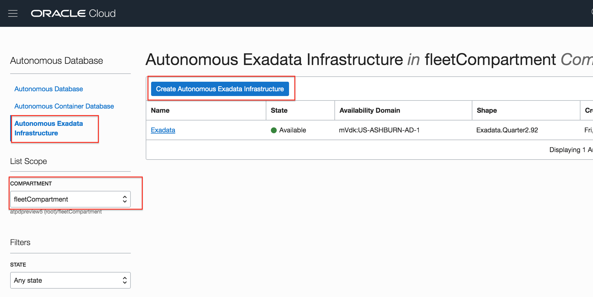
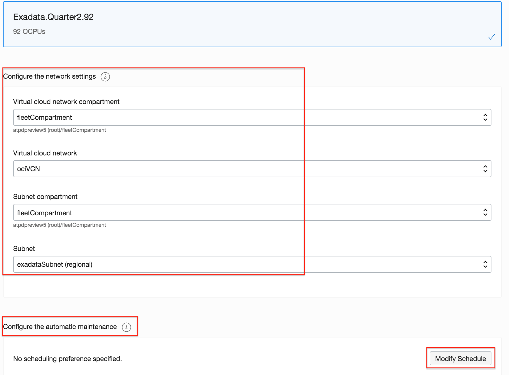
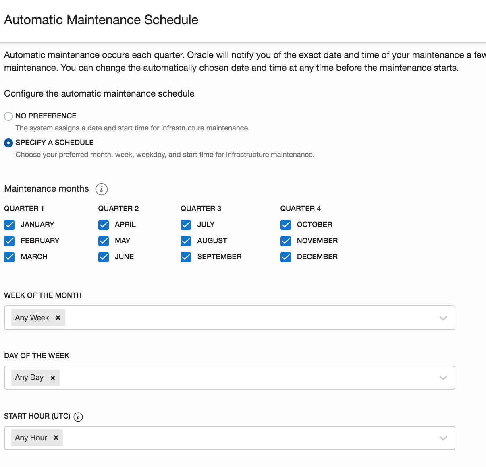
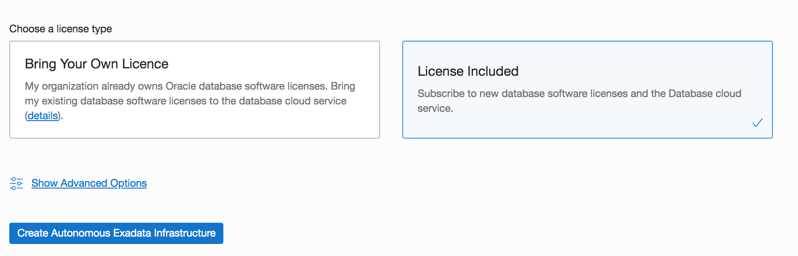

# Provisioning Autonomous Exadata Infrastructure for Autonomous Database in OCI

## Introduction
An Autonomous Exadata Infrastructure (AEI) resource allocates an available Oracle Exadata Database Machine to you. Its primary purpose is to act as a bridge between the hardware and software components of your dedicated infrastructure. You must create at least one Autonomous Exadata Infrastructure resource before you can create any of the other kinds of dedicated infrastructure resources such as Autonomous Container Databases or simply an Autonomous Database instance.

### Objectives

As a fleet administrator, 
1. Deploy an Autonomous Exadata Infrastructure in a pre-provisioned private network in your OCI account
2. Understand AEI maintenance scheduling
3. Understand database licensing options

### Required Artifacts
- An Oracle Cloud Infrastructure account with service limits to deploy at least one 1/4 rack of Exadata Infrastructure in any one region or Availability Domain.
- You also need privileges to create Autonomous Exadata Infrastructure and a container database in a pre-provisioned compartment and network.

Watch the video below for an overview of creating an Autonomous Container Database

## STEP 1: Deploy your Autonomous Exadata Infrastructure (AEI)

*Login to your OCI account as a fleet administrator*

Navigate to the 'Autonomous Transaction Processing' option in the top left hamburger menu from your OCI home screen.
    

Select 'Autonomous Exadata Infrastructure' and ensure you pick the fleet compartment as shown above. Click the blue 'Create Autonomous Exadata Infrastructure' button.
    

In the network section, select, 

1. The compartment that hosts the VCN; typically the fleetCompartment
2. Name of the VCN
3. The compartment that hosts the subnet, also fleetCompartment
4. The subnet to hold the exadata infrastucture

Your network or fleet administrator needs to setup the network before you can deploy an AEI. Please contact your network / account admin if a suitable network is not visible in the drop down options.

You can also modify the exadata and database maintenance schedules at this time. Click the 'Modify Schedule' button and specify the quarter, week, day and time you would like to schedule automatic maintenance for your exadata hardware and container databases.
    

You also have two options for selecting the license type for the database containers (ACDs) you deploy on your autonomous exadata infrastructure. You can either bring your spare corporate database licenses to OCI or you can buy a license subscription in the cloud. Pick the best option for you and hit the Create button. Your AEI will soon be ready to deploy autonomous container databases.
    

## Acknowledgements

*All Done! You have successfully deployed your Autonomous Exadata Infrastructure and it should be available shortly.*

- **Author** - Tejus S. & Kris Bhanushali
- **Adapted by** -  Yaisah Granillo, Cloud Solution Engineer
- **Last Updated By/Date** - Yaisah Granillo, March 2020

See an issue?  Please open up a request [here](https://github.com/oracle/learning-library/issues).   Please include the workshop name and lab in your request. 