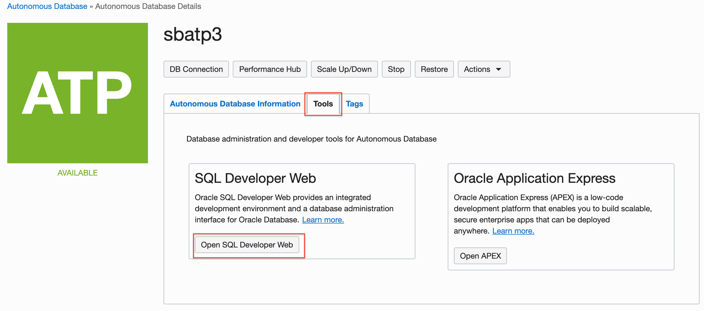
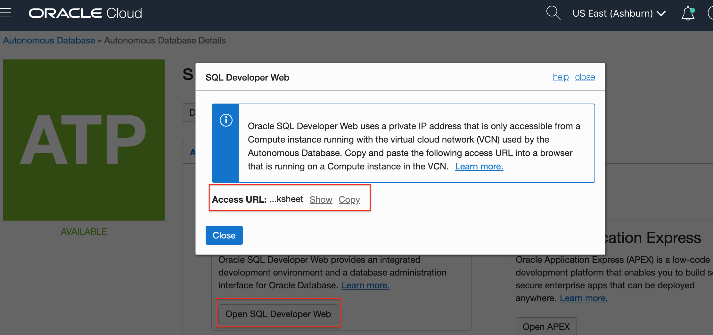
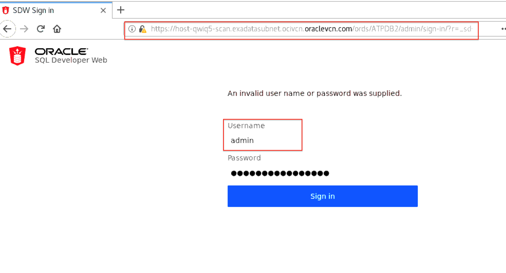
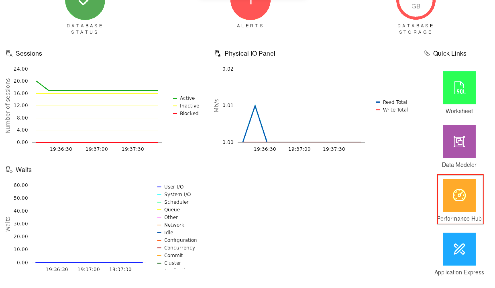
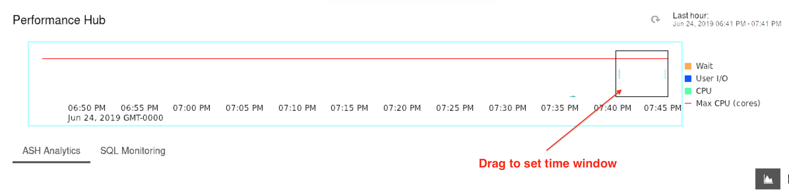
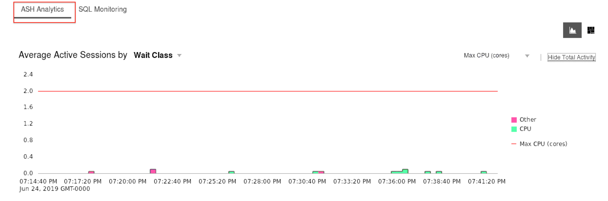
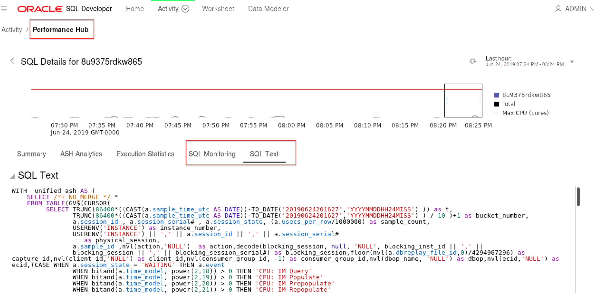

# Accessing SQL Developer Web and Performance hub consoles on your dedicated autonomous database instance

## Introduction
Oracle SQL Developer Web provides an integrated development environment and a database administration interface for Oracle databases in OCI. A web interface for Oracle SQL Developer, SQL Developer Web provides a subset of the features available for the desktop product and is bundled with various database services available in Oracle Cloud, including the dedicated autonomous database.

On the Performance Hub page of the SQL Developer Web console, you can monitor the performance of your Autonomous Database entities and ensure that these entities perform optimally.

This page allows you to view all the performance data available for a specific time period. Once a time period is selected, the database performance is displayed.

### Objectives

As an developer or DBA,

1. Access OCI autonomous database console and get URL for sql developer web cosole.
2. Create a VNC connection to developer client VM and access sqldevweb console.
3. Access performance hub for your autonomous database instance.

### Required Artifacts
- An Oracle Cloud Infrastructure account with access to Autonomous Transaction Processing console.
- A pre-provisioned autonomous database with admin access.
- A pre-provisioned developer client machine with network access to database.

## STEP 1: Access OCI autonomous database console and get URL for sql developer web cosole

- Login to your Oracle Cloud Infrastructure account and navigate to the console page of your dedicated autonomous database. 
    

- Navigate to the database details page and on the 'Tools' tab you will find the 'Open SQL Developer Web' button that would lead you to the SQL Developer Web access URL as shown below.
    
    

- Save the URL some place while you work on the next step to access your developer client machine over VNC.


## STEP 2: Create a VNC connection to developer client VM and access sqldevweb console 

- Since your autonomous database in a private network, you cannot access it with the URL above unless you are on a machine that has a network path to your database subnet. 

- Lets connect to the developer client machine you setup in [Lab 5](?lab=lab-5-configuring-development-system) using a secure ssh tunnel.

- Open an ssh tunnel from your local laptop to your developer client. For instructions, refer to [Lab 5](?lab=lab-5-configuring-development-system).

**Mac or Linux users** 

- Open a terminal window and create an ssh tunnel using the following command,

    ```
    <copy>
    $ ssh -N -L 5901:127.0.0.1:5901 -i \<priv-key-file\> opc@\<publicIP-of-your-devClient\> &
    </copy>
    ```

**Windows users**

- You can connect to and manage linux host mahine using SSH client. Recent versions of Windows 10 provide OpenSSH client commands to create and manage SSH keys and make SSH connections from a command prompt.

- Other common Windows SSH clients you can install locally is PuTTY. Click [here](https://docs.microsoft.com/en-us/azure/virtual-machines/linux/ssh-from-windows) to follow the steps to connect to linux host machine from you windows using PuTTY.

- Once you have an ssh tunnel open, you can now access your developer client machine using VNC Viewer or any other VNC Client.

- Open Firefox browser for the Applications menu top left and paste the SQL Developer Web Access URL you saved in Step 1.

    *Note: Mac users should user CRTL + V to paste into VNC and not Command + V*

- Provide the 'admin' username and password you created at the time of provisioning your database.
    

- Click Sign In and should should now be looking at your SQL Developer Web Console.

- Explore the SQL Developer Web interface and refer to its documentation for usage details.

- Alternatively, you may also access the SQLDevWeb console of your dedicated ATP instance from your local web browser If you are in the same OCI Network / VCN as your database. For detailed instruction on setting up a VPN connection into your private database cloud infrastructure, refer to [Lab 6](?lab=lab-6-configuring-vpn-into-private-atp).


## STEP 3: Access the Performance Hub through SQL Developer Web Console

- The SQL Developer Web home page provides quick links on the right to some of its key features, including the Performance Hub. 

- Click on the Performance Hub tile to navigate to it. 
    

*The Performance Hub consists of three major sections: Time Selector field and Time Slider, ASH Analytics tab, and SQL Monitoring tab.*

### **Time Selector field and Time Slider**
- The Time Selector field is displayed on the top-right corner and performance data for the time selected in this field is displayed on the Performance Hub. By default, Last 60 mins is selected in this field.
    

- The Time Slider on the Performance Hub shows the Active Sessions chart for the time period selected in the Time Selector field. The Active Sessions chart displays the average number of active sessions broken down by Wait, User I/O, and CPU. You can use the block on the Time Slider to select a shorter period of time for which data is displayed on the Performance Hub, and this is a subset of the period of time selected in the Time Selector field.

### **ASH Analytics tab**
- The ASH Analytics tab shows Active Session History (ASH) analytics charts to explore ASH data. It allows you to drill down into database performance across multiple dimensions such as Consumer Group, Wait Class, SQL ID, and User Name. On the ASH Analytics tab, you can perform tasks such as:

  - Selecting an Average Active Sessions dimension and viewing the top activity for that dimension for the selected time period. For information on ASH, see Active Session History (ASH) in Oracle Database Concepts.
    
  - Generating an Automatic Workload Repository (AWR) report. For information on AWR, see Automatic Workload Repository (AWR) in Oracle Database Concepts.

### **SQL Monitoring tab**
- The SQL Monitoring tab is not displayed by default and to view it, click SQL Monitoring on the Performance Hub.
    

- The SQL Monitoring tab enables real-time SQL monitoring and allows you to view long running SQL statements in your Autonomous Database. On this tab, you can drill down into individual SQL statements, view the execution plan and the amount of database time being used by each SQL execution plan line, and identify and analyze resource intensive SQL statements. Note that SQL statements are only monitored if they've been running for at least five seconds or if they're run in parallel.
    

## Acknowledgements

*Fantastic ! You successfully learned to use the SQL Developer Web Console and Performance hub on your autonomous database instance.*

- **Author** - Tejus S. & Kris Bhanushali
- **Adapted by** -  Yaisah Granillo, Cloud Solution Engineer
- **Last Updated By/Date** - Yaisah Granillo, March 2020

See an issue?  Please open up a request [here](https://github.com/oracle/learning-library/issues).   Please include the workshop name and lab in your request. 