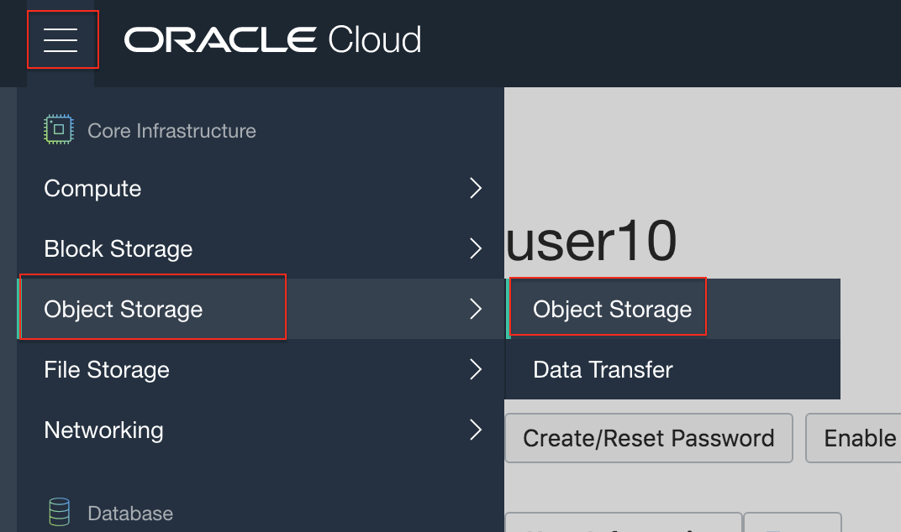
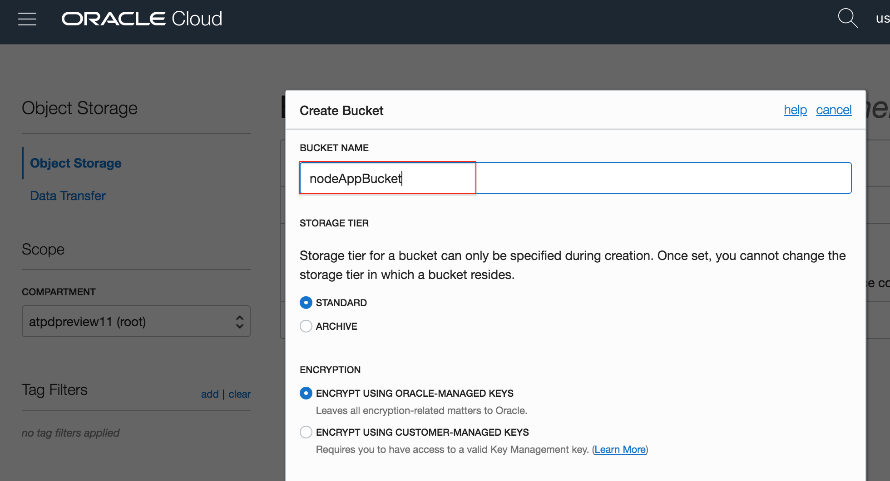
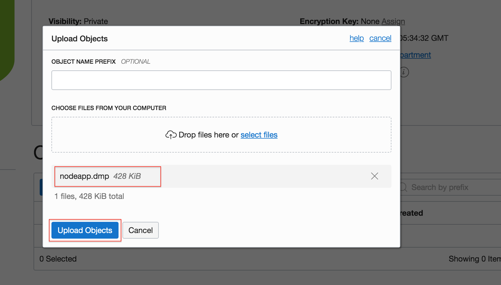
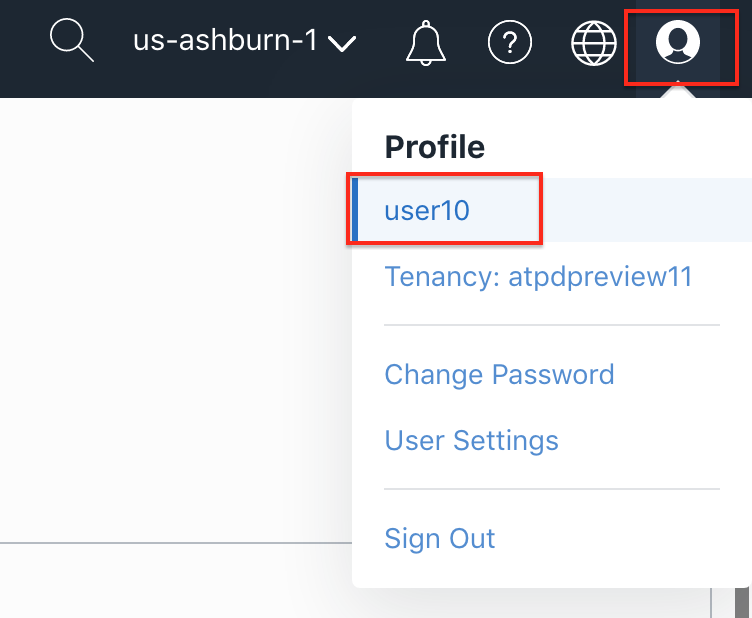
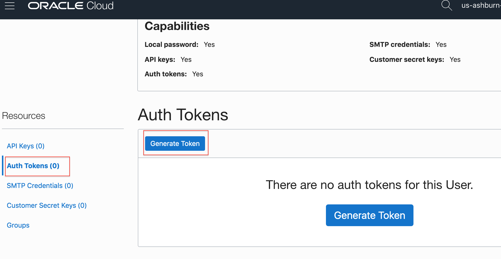
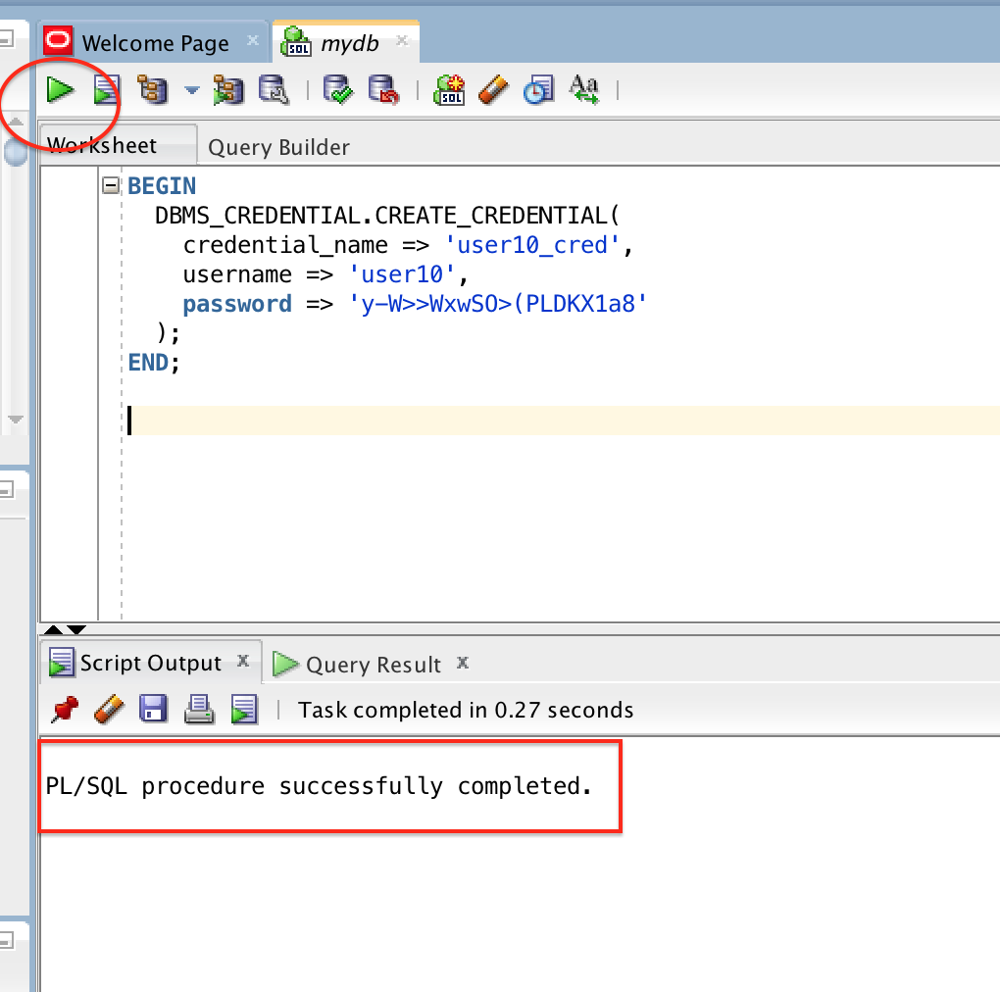
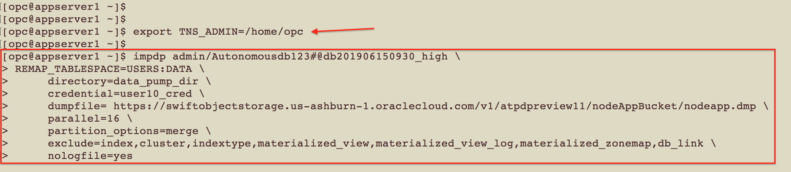
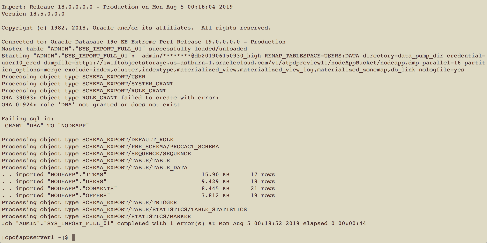

# Migrating to Dedicated ATP using Data Pump

## Introduction
Oracle Data Pump offers very fast bulk data and metadata movement between user managed Oracle databases and Autonomous Transaction Processing.

Data Pump Import lets you import data from Data Pump files residing on the Oracle Cloud Infrastructure Object Storage. You can save your data to your Cloud Object Store and use Oracle Data Pump to load data to dedicated ATP database.

This lab walks you through the steps to migrate a sample application schema using datapump import into your dedicated ATP database.


### Objectives

As a database admin or user,

1. Download a sample datapump export dump file from Oracle Learning Library github reposiory.
2. Upload .dmp file to OCI Object storage bucket.
3. Setup cloud credentials and use data pump import to move data to your ATP database.


### Required Artifacts
- An Oracle Cloud Infrastructure account with privileges to create object storage buckets and dedicated autonomous databases.
- Access to a pre-provisioned dedicated ATP instance. Refer to [Lab 4](?lab=lab-4-provisioning-databases).
- A pre-provisioned instance of Oracle Developer Client image in an application subnet. Refer to [Lab 6](?lab=lab-6-configuring-vpn-into-private-atp).

## STEP 1: Download sample data pump export file from Oracle Learning Library github repo

- Use the following command from your mac / PC to download a sample schema dump from OLL.

    ```
    <copy>
    wget https://objectstorage.us-ashburn-1.oraclecloud.com/p/8fcg4NskCWAIMvRpLE_ivj-a7baylei6XFF5_B1knzw/n/atpdpreview11/b/adb-data-pump/o/nodeapp.dmp
    </copy>
    ```
    
## STEP 2: Create an object storage bucket and upload dump

- Login to your OCI account with your user credentials.

- Naviage to Object Storage from top left hamburger menu.
    

- Pick a compartment you have priviledge to,
    

- Create a bucket and lets call it nodeAppBucket. Leave the encryption options to default and hit *Create Bucket*.
    

- Upload nodeapp.dmp downloaded from OLL.
    

## STEP 3: General an authentication token for your user account

- Assuming you are logged into your OCI account, navigate to the user details page from the top right menu item as shown below.
    

- Next on the user details page, scroll down to see  *Resources* on the left and generate an *Auth Token* as shown below.
    

- Provide any desired name and copy the generated token string some place in a text editor. You will need this token while configuring cloud credentials on your  target database.
    


## STEP 4: Setup Object Store user credentials in your target autonomous database

- Now that we have the credentials token, lets setup the target database to read from object store and import data.

- Log into your dedicated autonomous database as admin using either SQL Developer or SQLCL client.

    **TWO ways to do this:**

1. If you connected to your OCI VPN you provisioned earlier, you may directly launch SQL*Developer on your local machine and connect to your dedicated ATP as discussed in [Lab 6](?lab=lab-6-configuring-vpn-into-private-atp).

2. You may ssh to a developer client image provisioned in a public subnet as discussed in [Lab 5](?lab=lab-5-configuring-development-system). Once logged into your dev client, you may then launch SQL*Plus as discussed in Lab 6.  It is recommended you launch a dev client to use the command line import utility impdp later in this lab. Alternatively, you may also connect to your dev client over VNC and launch SQL Developer from there.

Here, we will use a local SQL Developer to demonstate the steps needed to setup object store credentials.

- Once connected to your autonomous database as user 'admin', run the following pl/sql procedure, replacing username and password with your own cloud credentials.

    ```
    <copy>
    BEGIN
     DBMS_CREDENTIAL.CREATE_CREDENTIAL(
     credential_name => 'userXX_cred',
     username => ‘OCI-Username',
     password => 'Your-Auth-Token-Here'
     );
     END;
    /
    </copy>
    ```

- Here's a screen shot of the above command run from a SQL Developer Client.
    

- Ensure the pl/sql procedure executed successfully from the log message.

## STEP 5: Import data from object store using impdp utility

- If all went well so far, proceed to ssh into your developer client machine and run the data pump import command.

    *Windows users may connect to the dev client using Putty.*       

    ```
    <copy>
    $ ssh -i <private-key-file> opc@<IPAddress-of-Dev-Client>
    </copy>
    ```

- You will also need to download your target database wallet file so impdp can make a secure connection to your target database.

- Besides, ensure TNS_ADMIN environment variable points to the location where you downloaded and unzipped your wallet. For eg. in this case we created a folder wallet under /home/opc, download *and unzip* the wallet in there.

    ```
    <copy>
    $ export TNS_ADMIN=/home/opc/wallet
    </copy>
    ```

- Finally, the stage is set to run the import command from your dev client bash prompt.

    ```
    <copy>
    $ impdp admin/password@connect_string \
    REMAP_TABLESPACE=USERS:DATA \
        directory=data_pump_dir \
        credential=userXX_cred \
        dumpfile= https://swiftobjectstorage.us-ashburn-1.oraclecloud.com/v1/Tenancy-Name/Bucket-Name/nodeapp.dmp \
        parallel=16 \
        partition_options=merge \
        exclude=index,cluster,indextype,materialized_view,materialized_view_log,materialized_zonemap,db_link \
        nologfile=yes
    </copy>
    ```

- In the above command, replace the following:

    *password* - Admin password for your autonomous DB

    *connect\_string* - Connect string obtained from database console, it would be something like myDatabase_high

    *directory* - Leave as shown above for default or create your own directory object in database

    *dumpfile* - Use swift URL. If your .dmp file is in Ashburn, simply replace tenancy and bucket name

    Ensure *nologfile=yes*, else the command fails.
    

- If all goes well, your import will complete in a minute as shown below. Ignore the below statement.

    *Failing sql is:
    GRANT "DBA" TO "NODEAPP"*

    It indicates that while the user 'NODEAPP' had the DBA role assigned in the source database, that role is not available in the ATP instance due to security lockdowns. More details on ATP security lockdowns can be found [here](https://docs.oracle.com/en/cloud/paas/atp-cloud/atpdg/experienced-database-users.html#GUID-11ABDC70-C99F-48E4-933B-C7D588E4320A).
    

All Done! Your application schema was successfully imported. Note that once uploaded to object store, the dump file was in a private bucket with no visibility outside of your tenancy namespace. This is important so your data file is not accessible from anyone on the internet.

You may now connect to your autonomous database using a SQL client and validate import.


## Acknowledgements

*Congratulations! You have successfully completed migration of an Oracle database to the dedicated Autonomous service.*

- **Author** - Tejus S. & Kris Bhanushali
- **Adapted by** -  Yaisah Granillo, Cloud Solution Engineer
- **Last Updated By/Date** - Kris Bhanushali, June 2020

See an issue?  Please open up a request [here](https://github.com/oracle/learning-library/issues).   Please include the workshop name and lab in your request. 