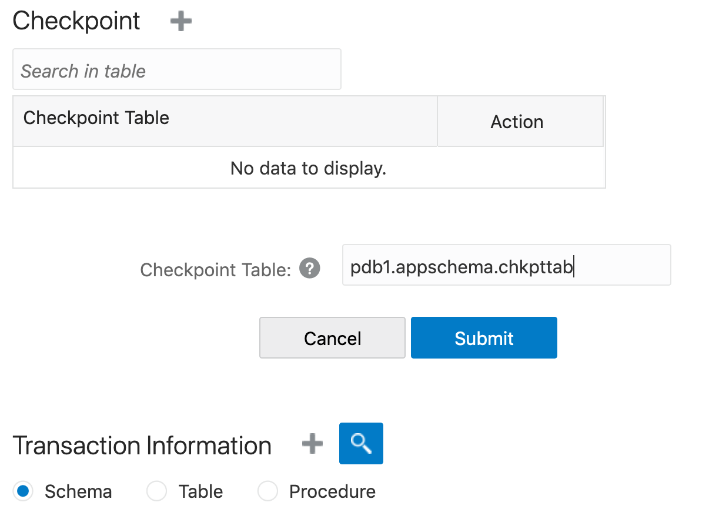
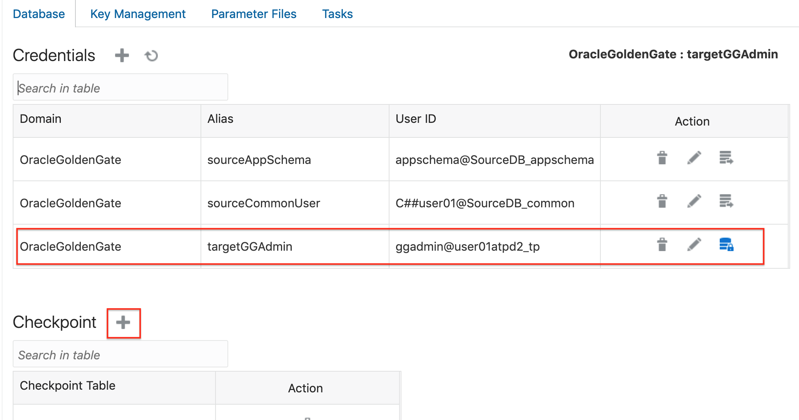
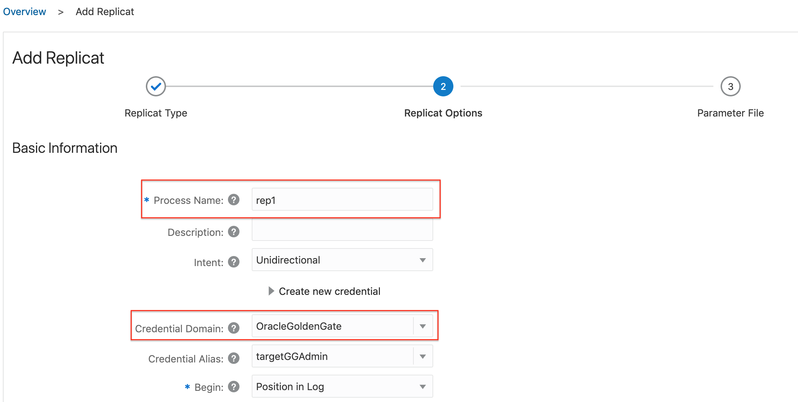

# Live migration to ATP-Dedicated using Oracle Goldengate Replication

## Introduction
Data Replication is a essential part of your efforts and tasks when you are migrating your Oracle databases. While data migration can be acheived in many ways, there are fewer options when downtime tolerance is low and live, trickle feed replication may be the only way. Oracle Cloud Infrastructure Marketplace provides a goldengate microservice that can easily be setup for logical data replication between a variety of databases. In this hands-on lab we will setup goldengate to replicate data from a 12.2 Oracle database comparable to an 'on-prem' source database to an ATP Dedicated database in OCI. This approach is recommended while migrating most production or business critical application to Autonomous dedicated.

**Why Golden Gate?**

- Oracle Golden Gate is an enterprise grade tool which can provide near real time data replication from one database to another. 
- Oracle Golden Gate offers a real-time, log-based change data capture (CDC) and replication software platform to meet the needs of today’s transaction-driven applications. It provides capture, routing, transformation, and delivery of transactional data across heterogeneous environments in real time can be acheived using Golden Gate. 
- Oracle Golden Gate only captures and moves committed database transactions to insure that transactional integrity is maintained at all times. The application carefully ensures the integrity of data as it is moved from the source database or messaging system, and is applied to any number of target databases or messaging systems.

    [Learn More about Golden Gate](http://www.oracle.com/us/products/middleware/data-integration/oracle-goldengate-realtime-access-2031152.pdf).


### Objectives

1. Setup real time data replication from on-premise database to ATP-D database instance.

### Required Artifacts

- Access to an Oracle Cloud Infrastructure tenancy.
- Access to an Oracle 12c database configured as source database.
- An Autonomous Transaction Processing-Dedicated as target database.
- Access to ATP-D network via jump server or VPN.
- VNC Viewer or other suitable VNC client on your laptop.

### Background and Architecture

- There are three components to this lab. The *source database* that you are planning to migrate to Autonomous, the *target autonomous database* in OCI and an instance of *Oracle Goldengate* server with access to both source and target databases.

- The source database can be any Oracle database version 11.2.0.4 or higher with atleast one application schema that you wish to replicate to an autonomous database in OCI. For the purpose of this lab, you may provision a 12.2.0.1 DBCS instance in your compartment in OCI and configure it as source. 

- The ATP Dedicated database instance you provisioned in [Lab 4](?lab=lab-4-provisioning-databases) can be used as a target database in this lab. Since this database is in a private network with no direct access over the internet, you need to either VPN into this network or setup a developer client / bastion host via which you can connect to your target atp-d instance using sql*plus or sql developer client. Refer [Lab 5](?lab=lab-5-configuring-development-system) or [Lab 6](?lab=lab-6-configuring-vpn-into-private-atp) to setup a jump server or setup VPN respectively. 

    *Note: You cannot complete this lab without setting up access to your ATPD instance. Therefore, [Lab 5](?lab=lab-5-configuring-development-system) or [Lab 6](?lab=lab-6-configuring-vpn-into-private-atp) are a pre-requisite to completing this lab as instructed.*

    - The Golden Gate software is going to be deployed on a linux server in a public network which has access to both the source database and the target database via the Goldengate marketplace image in OCI.

## STEP 1: Provision a Goldengate Microservice from OCI Marketplace

- Connect to your OCI tenancy and select *Marketplace* from top left menu.

  - Browse for *Oracle Goldengate 19c for Oracle*. You may set a filter on Type on the left. Select *Stack* from the dropdown and the image should be easier to find. The image is a terraform orchestration that deploys Goldengate on a compute image along with required resources.

- Click on 'Image' and choose your compartment to deploy the goldengate instance. For example, as a workshop user with assigned compartment userX-Compartment, pick userX-Compartment from the drop down.

- Launch Stack and provide details as described below.

    *Name:* Any descriptive name or you could leave default.

    Hit *Next*. The rest of the items are filled in or optional.

- Enter the following network setting. This is essentially to select the network you wish to deploy your goldengate image.
    

- Hit 'Next'. For instance details, pick an AD with sufficient compute capacity. *Note this deployment needs a minimum 2 ocpu instance*.

    Make sure you check the 'public IP' checkbox. We will use this later to ssh into the instance and also connect to the Goldengate admin console.
    

- Next, under *Create OGG deployments* choose your source and target deployment names and versions. Note that you may select one or two deployments (the second deployment is optional). This simply tells Goldengate admin server the location of relevant artifacts for source and target DB connections. 

- In this lab, we choose a single deployment called Databases. Therefore, under *Deployment 1 -Name*, type *Databases* and leave Deployment 2- Name blank. We keep this simple by using a single deployment folder for both source and target configurations.
    

- Next, paste your public key and hit *Create*.

- Your Goldengate instance should be ready in a few minutes and we will come back to configure it. 

## STEP 2: Configure the source database

It is assumed that you either have an Oracle 12c database configured as source or know how to provision a 12c DBCS instance in OCI.

[This Medium blog provides step by step directions to deploying a DBCS instance in OCI.](https://medium.com/@fathi.ria/oracle-database-on-oci-cloud-ee144b86648c)

The source database requires a Common (CDB) user that has DBA privileges over all PDBs in that database. 

Lets also assume that the schema we wish to replicate with Goldengate is the 'appschema' in PDB1. So for a freshly provisioned DBCS instance as source, we create the common user and application schema as follows.

- Connect as sys to your source DB and execute the following SQL commands.

    ````
    <copy>
    create user C##user01 identified by WElcome_123#;
    grant connect, resource, dba to c##user01;
    alter database add supplemental log data;
    exec dbms_goldengate_auth.grant_admin_privilege('C##user01', container=>'all');
    alter system set ENABLE_GOLDENGATE_REPLICATION=true scope=both;
    </copy>
    ````

    Check if Goldengate replication is enabled,

    ````
    <copy>
    show parameter ENABLE_GOLDENGATE_REPLICATION;
    </copy>
    ````

    This should return *True*.

- Next, lets create a schema user to replicated called *appschema* in PDB1 and add a table to it. A sample 'Comments' table is provided here. You may add one or more table of your choice to the appschema.

    ````
    <copy>
    alter session set container=pdb1;
    create user appschema identified by WElcome_123# default tablespace users;
    grant connect, resource, dba to appschema;
    CREATE TABLE appschema.COMMENTS
    (  "COMMENT_ID" NUMBER(10,0), 
    "ITEM_ID" NUMBER(10,0), 
    "COMMENT_BY" NUMBER(10,0), 
    "COMMENT_CREATE_DATE" DATE DEFAULT sysdate, 
    "COMMENT_TEXT" VARCHAR2(500)
    ) ;
    </copy>
    ````

    The source database is all set. Next, lets setup the target ATPD instance.

## STEP 3: Configure the target ATP Dedicated database

- Connect to the ATPD database service intance you created earlier as user *admin*.

    *Note: You will need to be VPN'd into the network or VNC to a jump server. Refer to Lab 5 and Lab 6.*

- First, lets unlock the goldengate user that comes pre-created in ATP-D.

    ````
    <copy>
    alter user ggadmin identified by WElcome_123# account unlock;
    alter user ggadmin quota unlimited on data;
    </copy>
    ````

- Next we create an 'appschema' user similar to source and create the same set of tables as source.

    ````
    <copy>
    create user appschema identified by WElcome_123# default tablespace data;
    grant connect, resource to appschema;
    alter user appschema quota unlimited on data;
    CREATE TABLE appschema.COMMENTS
    (  "COMMENT_ID" NUMBER(10,0), 
    "ITEM_ID" NUMBER(10,0), 
    "COMMENT_BY" NUMBER(10,0), 
    "COMMENT_CREATE_DATE" DATE DEFAULT sysdate, 
    "COMMENT_TEXT" VARCHAR2(500)
    ) ;
    </copy>
    ````
That is it! Your target DB is now ready.

## STEP 4: Configure Goldengate service
- By now, your Goldengate service instance must be deployed. On your OCI console navigate to *Compute* from top left menu and *choose your compartment*.

- Click on your Goldengate compute instance to get to the details page that looks as follows.
    

    *Note down the public IP address of your instance. We will use this IP to ssh into the virtual machine.*

- Before we launch the Goldengate admin console and start configuring the service, we need to provide connection information for both source and target databases.

    - Therefore, gather your source database connection TNS entries for both the common user and the appschema user. Remember, the CDB and PDB run different services, therefore the TNS entries differ.

    - A tns entry is typically found in your database's tnsnames.ora file and looks like this.

    ```
    <copy>
    mySourceDB=(DESCRIPTION=(CONNECT_TIMEOUT=120)(RETRY_COUNT=20)(RETRY_DELAY=3)(TRANSPORT_CONNECT_TIMEOUT=3)(ADDRESS_LIST=(LOAD_BALANCE=on)(ADDRESS=(PROTOCOL=TCP)(HOST=129.30.xxx.xxx)(PORT=1521)))(CONNECT_DATA=(SERVICE_NAME=pdb1.atp.oraclecloud.com)))
    </copy>
    ```

- Also get your ATPD wallet zip file ready to upload / SCP to the goldengate instance. 

    *This file needs to go into the folder /u02/deployments/Databases/etc.*

    Remember the deployment name 'Databases' provided while provisioning the goldengate image? That is what it does. By proviing just one deployment, we can configure both source and target DB entries in one place for simplicity.

    ````
    <copy>
    $ scp -i ~/id_rsa Wallet_MyATPDB.zip opc@129.xxx.234.11:/u02/deployments/Databases/etc
    </copy>
    ````

- Next, ssh into the instance and unzip the wallet.

    ```
    <copy>
    $ ssh -i ~/id_rsa opc@129.xxx.234.11
    $ cd /u02/deployments/Databases/etc
    $ unzip Wallet_MyATPDB.zip
    </copy>
    ```

- Edit the sqlnet.ora file and update the WALLET_LOCATION parameter to point to the wallet folder.

    ````
    <copy>
    WALLET_LOCATION = (SOURCE=(METHOD=FILE)(METHOD_DATA=(DIRECTORY="/u02/deployments/Databases/etc")))
    </copy>
    ````

- Next we edit the tnsnames.ora file and add entries for the source common user and the source appschema user. This single tnsnames.ora will serve to connect to both source and target.

- Open tnsnames.ora in vi and add TNS connection entries as shown in the example screen shot below. Note the 2 new TNS entries added at th bottom for the source DB in addition to the pre-existing entries for target.
    

    - Also, source DB is in a public network in this example hence hostname is the public IP address. 

    *Note: All IP addresses in the lab guide are scrubbed for security purposes. None of the instances in the screenshots are accessible using the information provided.*

- We are now ready to access the goldengate admin console and configure our extract and replicat processes. 

- The credentials to access the admin console are provided in a file called ogg-credentials.json in the home folder /home/opc .

    - Open the file and save the credentials on a notepad.

    ````
    <copy>
    $ cd
    $ cat ogg-credentials.json
    {"username": "oggadmin", "credential": "E-kqQH8.MPA0u0.g"}
    </copy>
    ````
- Next we logon to the Goldengate admin console using credentials above.

    *Open a browser and navigate to https://(ip\_address\_of\_goldengate\_image)*.

    If you have browser issues or get Unicode warning, try using Firefox browser. Fixing browser issues is beyond scope for this lab guide.
    

- Once logged on, click on the port # for Admin server to get into configurtion mode as shown below.
    

    If prompted, login with the same credentials one more time.

- From the top left hamberger menu, select 'Configuration' as shown below:
    

    Here we configure connectivity to our source and target databases. We will setup 3 connections - The Source DB common user, Source DB appschema user and Target DB ggadmin user. 
    

- Add the first credential for C##user01 you created earlier in the lab in the source DB.
    

    *Note the userid format is userid@connectString. The connect string is how it knows which database to connect to. It looks for this connect string in /u02/deployments/Databases/etc/tnsnames.ora*

- Submit credentials and test connectivity as shown in screenshot below.
    

- Similarly, add credentials for source DB appschema and target ATPD ggadmin schema as shown below. Note the ggadmin user connects using the same tns enty as 'admin' user.
    

    *Make sure you test connectivity for each credential.*

- Next, we **create checkpoint tables** in source and target databases. Checkpoint tables keep track of changes in the database. We need one in the appschema in source and another in the ggadmin schema in target.

    - Lets start with appschema in source. Connect and click + sign to add a checkpoint table as shown below.
        
        

    - We also specify the schema we want to replicate here. In the Transaction Information section below checkpoint, add the schema first by clicking the + sign and hit Submit.
        

    - Now when you enter the schema name and search for it, it shows up as shown below with 3 tables. 2 checkpoint tables and one 'comments' table we created earlier.
        


- Next, we **add a checkpoint table** to the target instance and also set the heartbeat.

    - Connect to the target DB from the goldengate admin console just like you did for the source DB. Lets also add a checkpoint table here.
        
        

    - Scroll down and set the hearbeat for target. Use default configuration for the purpose of this lab.
        

- As a final step, we now **create an 'extract' and a 'replicate' process** to conduct the replication from source to target.

    - Navigate back to the Goldengate Admin server dashboard so you can see both the extract and replicat setup as shown below.
        

    - Choose *Integrated Extract* on the next screen and hit next.

    - Entries on the following screen may be entered as follows,
        

        *Process Name:* Provide any name of choice

        *Credential Domain:* Pick OracleGoldenGate from drop down

        *Credential Alias:*  Pick the common user alias for source DB. In this lab we created sourceCommonUser alias

        *Trail Name:* Any 2 character name

    - Scroll down and click in the text box Register to PDBs. PDB1 should popup as shown.
        

        *If you do not see Register to PDBs text box, make sure you have picked the 'Common User' alias and provided all mandatory entries.*

    - Click next. As a final step, add this entry at the end of your parameter file as shown below.

        ````
        <copy>
        extract ext1
        useridalias sourceCommonUser domain OracleGoldenGate
        exttrail rt
        table pdb1.appschema.*;
        </copy>
        ````

        

        This tells Goldengate to capture changes on all tables in pdb1.appschema.

    - Hit 'Create and Run'. If all goes well you should now see the extract running on source.
        


- Next, we configure a replicat on the target. On the same screen hit the *+* sign on the *Replicats* side to start configuring one.

    - Pick *Non-Integrated Replicat*
        

- Fill out the mandatory items in *Basic Information* on the next screen as follows. You may leave the rest at default values.

    *Process Name:*  Rep1

    *Credential Domain:*  Oracle Goldengate from drop down

    *Credential Alias:* targetGGAdmin (or the alias name you provided for ggadmin user on your ATP-D instance)

    *Trail Name:* rt (or any 2 character name)

    *Checkpoint Table:* The checkpoint table you configured for ggadmin user should show up in the drop down

    Hit *Next*.

    
    

- On the last and final screen (phew!) edit the parameter file to REPLACE the line mapping the source and target schemas as show below. 
  
    *Note: Please remove the original line MAP \*.\*, TARGET \*.\*;*

    

- Hit *Create and Run*. If all goes well, you should now see both extract and replicat processes running on the dashboard.
    

Hurray! You have completed the replication setup. To test, simply connect to your source database, insert and commit some rows. Then check your corresponding target table and in a few secs you should see the data appear.

- A sample Insert script for the Comments table is provided below.

    ````
    <copy>
    Insert into appschema.COMMENTS (COMMENT_ID,ITEM_ID,COMMENT_BY,COMMENT_CREATE_DATE,COMMENT_TEXT) values (7,4,4,to_date('06-JUL-15','DD-MON-RR'),'Im putting an offer. Can you meet me at the apple store this evening?');
    commit;
    </copy>
    ````

## Acknowledgements
*Great work!*
- **Author** - Tejus S. & Kris Bhanushali
- **Adapted by** -  Yaisah Granillo, Cloud Solution Engineer
- **Last Updated By/Date** - Yaisah Granillo, March 2020

See an issue?  Please open up a request [here](https://github.com/oracle/learning-library/issues).   Please include the workshop name and lab in your request. 